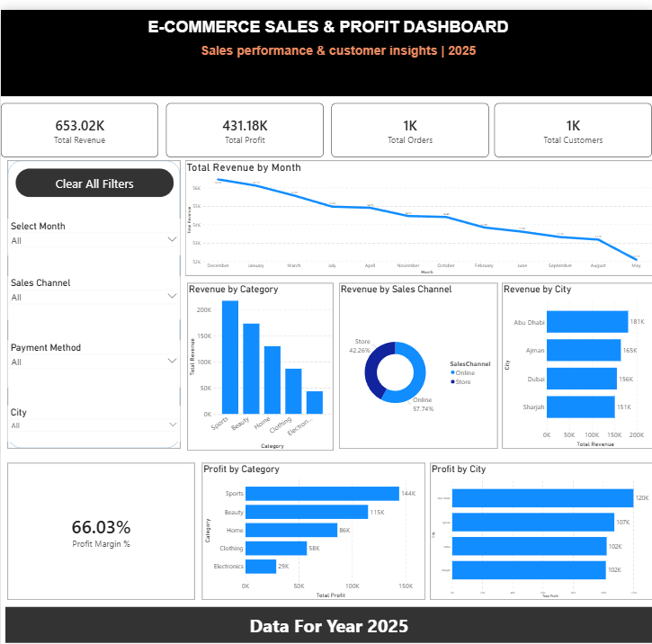

# 📊 E-Commerce Sales & Profit Dashboard

A Power BI dashboard designed to analyze e-commerce sales performance, profitability, customers, products, sales channels, and geographic performance.

## 📸 Dashboard Preview

## 🎯 Project Overview

This project analyzes e-commerce sales data for 2025 and provides an interactive dashboard to help understand business performance and identify important sales and profit trends.

## 📌 Key KPIs

- Total Revenue: 653.02K
- Total Profit: 431.18K
- Total Orders: 1K
- Total Customers: 1K
- Profit Margin: 66.03%

## 📈 Dashboard Insights

The dashboard includes:

- Monthly revenue trends
- Revenue by product category
- Revenue by sales channel
- Revenue by city
- Profit by category
- Profit by city
- Profit margin analysis
- Interactive filters for:
  - Month
  - Sales Channel
  - Payment Method
  - City

## 🛠️ Tools & Technologies

- **Power BI** — Dashboard development and data visualization
- **DAX** — Calculated measures and business metrics
- **SQL** — Data querying and analysis
- **MySQL** — Database management
- **Data Modeling** — Relationships between fact and dimension tables

## 🗂️ Data Model

The project uses a star-schema style data model containing:

- Orders
- Products
- Customers
- Date Table

Relationships were created between the fact table and dimension tables to support accurate analysis.

## 🧮 DAX Measures

Examples of measures created:

- Total Revenue
- Total Profit
- Total Orders
- Total Customers
- Profit Margin %

## 💡 Key Findings

The dashboard allows users to quickly identify:

- Revenue performance over time
- Most profitable product categories
- Sales channel contribution
- City-level revenue and profit
- Overall business profitability

## 👨‍💻 Author

**Sajid**

Aspiring Data Analyst | Power BI | SQL | Python | Data Visualization

**Dataset**: Synthetic e-commerce dataset created for analytics and dashboard practice.
